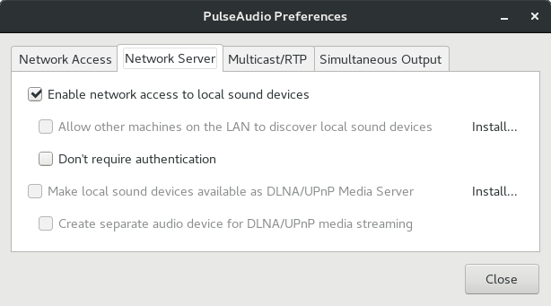

# Docker Reference - CentOS 7

## Writing Dockerfiles

### Understand how ARG and FROM interact

FROM instructions support variables that are declared by any ARG instructions that occur before the first FROM.

```
ARG  CODE_VERSION=latest
FROM base:${CODE_VERSION}
CMD  /code/run-app

FROM extras:${CODE_VERSION}
CMD  /code/run-extras
```

An ARG declared before a FROM is outside of a build stage, so it can’t be used in any instruction after a FROM. To use the default value of an ARG declared before the first FROM use an ARG instruction without a value inside of a build stage:

```
ARG VERSION=latest
FROM busybox:$VERSION
ARG VERSION
RUN echo $VERSION > image_version
```

Refer [Dockerfile reference](https://docs.docker.com/engine/reference/builder/#from)

### Generate a timestamp before cloning a git repo

When you build docker, docker will cache each step. If you change the dockerfile and build again, docker will not re-execute a step if it has already been run before. We can add and increment a timestamp to a command
to ensure that we re-execute a git clone command each time we rebuild a dockerfile.

You can generate the current date timestamp in bash using the command:
```
date -u +'%Y-%m-%d-%H:%M:%S'
```

You can use a build script to pass the current build time to a Dockerfile
using a build `ARG`

```
docker build --no-cache=true --build-arg BUILD_DATE=$(date -u +'%Y-%m-%d-%H:%M:%S') -t alpine:test .
```

```
FROM alpine:latest
LABEL maintainer="name@domain.com"

ARG BUILD_DATE

LABEL org.label-schema.build-date=$BUILD_DATE

RUN echo $BUILD_DATE \
    && mkdir -p /project/software/infrastructure/docker \
    && cd /project/software/infrastructure/docker \
    && git clone git://github.com/edowson/docker-doc doc
```

### Enabling PulseAudio

Refer the following resources for getting pulseaudio working with docker container:
- [docker-chrome-pulseaudio ](https://github.com/jlund/docker-chrome-pulseaudio)
- [docker-pulseaudio-example - TheBiggerGuy - GitHub](https://github.com/TheBiggerGuy/docker-pulseaudio-example)


Install pulseaudio preferences:
```
sudo yum install paprefs
```

Launch PulseAudio Preferences, go to the "Network Server" tab, and check the "Enable network access to local sound devices" checkbox.




You can test if pulseaudio is working by typing in the following command:
```
pacat /dev/urandom
```


```
stat /run/user/1001/pulse/native
  File: ‘/run/user/1001/pulse/native’
  Size: 0         	Blocks: 0          IO Block: 4096   socket
Device: 2dh/45d	Inode: 73128       Links: 1
Access: (0777/srwxrwxrwx)  Uid: ( 1001/   developer)   Gid: ( 1001/   developer)
Context: unconfined_u:object_r:user_tmp_t:s0
Access: 2018-08-15 21:49:22.472099247 +0400
Modify: 2018-08-15 21:49:22.463099421 +0400
Change: 2018-08-15 21:49:22.463099421 +0400
```

If the pulseaudio daemon is refusing a connection, type the following command
in a separate terminal sessions before starting a docker container:
```
pulseaudio -k && pulseaudio -vvvv
```

After launching the container, you should get a message which indicates the
source of a connection  failure:
```
D: [pulseaudio] module-udev-detect.c: /dev/snd/controlC1 is accessible: yes
D: [pulseaudio] module-udev-detect.c: Resuming all sinks and sources of card alsa_card.pci-0000_01_00.1.
D: [pulseaudio] module-udev-detect.c: /dev/snd/controlC0 is accessible: yes
D: [pulseaudio] module-udev-detect.c: Resuming all sinks and sources of card alsa_card.pci-0000_00_1f.3.
I: [pulseaudio] socket-server.c: TCP connection accepted by tcpwrap.
I: [pulseaudio] client.c: Created 3 "Native client (TCP/IP client from 172.17.0.2:47612)"
D: [pulseaudio] protocol-native.c: Protocol version: remote 30, local 32
W: [pulseaudio] protocol-native.c: Denied access to client with invalid authentication data.
I: [pulseaudio] client.c: Freed 3 "Native client (TCP/IP client from 172.17.0.2:47612)"
I: [pulseaudio] protocol-native.c: Connection died.
```

Edit file `/etc/pulse/system.pa`
```
### Load several protocols
.ifexists module-esound-protocol-unix.so
#load-module module-esound-protocol-unix
.endif
load-module module-native-protocol-unix
```

Edit file `/etc/pulse/default.pa`, comment out the following:
```
### Automatically connect sink and source if JACK server is present
#.ifexists module-jackdbus-detect.so
#.nofail
#load-module module-jackdbus-detect channels=2
#.fail
#.endif
```

and un-comment the following:
```
### Network access (may be configured with paprefs, so leave this commented
### here if you plan to use paprefs)
load-module module-native-protocol-tcp
```

and modify the followng lines:
```
### Load several protocols
.ifexists module-esound-protocol-unix.so
#load-module module-esound-protocol-unix
.endif
load-module module-native-protocol-unix
```

Install pulseaudio pavucontrol pavumeter:
```
sudo yum install pavucontrol pavumeter
```

## Command Reference

This section provides a list of useful docker commands for managing
docker containers and images.

List docker images

```
sudo systemctl start docker
sudo docker images

REPOSITORY          TAG                               IMAGE ID            CREATED             SIZE
nvidia/cuda/ros     9.2-melodic-morenia-ubuntu18.04   fc0f9b532b35        21 hours ago        3.12GB
nvidia/cuda         9.2-cudnn7-devel-ubuntu18.04      cfd441bcc24e        13 days ago         2.91GB
nvidia/cuda         latest                            943880547a6a        13 days ago         1.95GB
hello-world         latest                            e38bc07ac18e        2 months ago        1.85kB
```


#### Run a docker image
```
CONTAINER_ID=$(sudo docker run -d -P --name ros-melodic-morenia nvidia/cuda/ros:9.2-melodic-morenia-ubuntu18.04)
```

Command Explaination:
- -d: detached mode
- -P: expose all the ports to the host machine

The environment variable $CONTAINER_ID contains the ID of the new running container created from the nvidia/cuda/ros:9.2-melodic-morenia-ubuntu18.04 image.

Getting the password generated during runtime:
```
echo $(sudo docker logs $CONTAINER_ID | sed -n 1p)
```

#### Delete a docker image
```
sudo docker images
sudo docker rmi <image-id>
```

#### List all docker containers
```
sudo docker ps -a
```

#### Stop all running docker containers
```
sudo docker stop $(sudo docker ps -aq)
```

#### Remove all docker containers
```
sudo docker rm $(sudo docker ps -aq)
```

#### Remove all docker images
```
sudo docker rmi $(sudo docker images -q)
```

#### Run a persistent container
```
NV_GPU=0,1 docker run --runtime=nvidia --name digits -d -p 5000:5000 nvidia/digits
```

Command Explanation:

-    NV_GPU=0,1
        This is a method of assigning GPU resources to a container which is critical for leveraging DOCKER in a Multi GPU System. This passes GPU ID 0,1 from the host system to the container as resources. Note that if you passed GPU ID 2,3 for example, the container would still see the GPUs as ID 0,1 inside the container, with the PCI ID of 2,3 from the host system.
-    nvidia-docker – the NVIDIA shim/wrapper that helps setup GPUs with DOCKER
    run – tells nvidia-docker wrapper that you’re going to start (instantiate) a container
        Note that for any command that does not include ‘run’ in it, you can simply use docker, but if you use nvidia-docker the command gets passed through to docker (E.g docker images displays the docker images on your system, nvidia-docker images would also execute and show the same info)
-    –name digits
        This names your container instance, you need a unique name for each instance created in this way. It adds another way for instances to be referenced by, the default method is an instance ID Hash
-    -d
        Instructs DOCKER that this will be a daemonized/persistent container
-    -p 5000:5000
        This is a way of port mapping. 5000 is being mapped to 5000 for the DIGITS web server port.
        If you ran multiple containers/instances of DIGITS, for example you could do -p 5001:5000 for the next container and you would be able to connect to it at the IP_ADDRESS:5001 location, and still connect to IP_ADDRESS:5000 of the other DIGITS container.
-    nvidia/digits
        Which image we’re launching

After running this command, you could connect to DIGITS at the URL of the host system, at port 5000. It would have access to GPU ID 0,1 as resources within the container and within DIGITS in that container. If, for example this was a 4 GPU machine, you could run the following to create another container, based on that same image, but expose a different port so that the two containers don’t conflict with each other, and specifiy different GPUs so the containers don’t try and utilize the same GPGPU resources.

```
[user@host~]# NV_GPU=2,3 nvidia-docker run --name digits -d -p 5001:5000 nvidia/digits
95e42817050c3e6de88f61473692a71ac0ab0948fe873c06155b95b62dad5554 # Instance ID!
```

Now you would have another DIGITS instance on port 5001 that would be accessible from a web browser, and this DIGITS installation would have access to the GPU ID 2 and 3 from the host system.


```
# Use a docker volume
https://docs.docker.com/storage/volumes

# nvidia-persistenced
https://docs.nvidia.com/deploy/driver-persistence/index.html

# best practices
https://developers.redhat.com/blog/2016/02/24/10-things-to-avoid-in-docker-containers/
```

#### Deleting Volumes

Chances are, if you’ve been using docker rm to delete your containers, you probably have lots of orphan volumes lying about taking up space.

Volumes are only automatically deleted if the parent container is removed with the docker rm -v command (the -v is essential) or the –rm flag was provided to docker run. Even then, a volume will only be deleted if no other container links to it. Volumes linked to user specified host directories are never deleted by docker.

To have a look at the volumes in your system use docker volume ls:
```
$ docker volume ls
DRIVER              VOLUME NAME
local               8e0b3a9d5c544b63a0bbaa788a250e6f4592d81c089f9221108379fd7e5ed017
local               my-vol
```

To delete all volumes not in use, try:
```
$ docker volume rm $(docker volume ls -q)
```

#### Deleting btrfs subvolumes

```
sudo -s
cd /var/lib/docker
btrfs subvolume delete btrfs/subvolumes/*

# delete subvolumes for a specific user
cd /var/lib/docker/1026.982
btrfs subvolume delete btrfs/subvolumes/*
```

### Linux Command Reference

List users with uids:
```bash
getent passwd | cut -d: -f1,3
```

List groups with gids:
```bash
getent group
```

Create a group with gid:

```bash
sudo groupadd -g 101000 docker-developer
sudo usermod -aG docker-developer developer
```

Delete a group:
```bash
sudo groupdel docker-developer
```


### Issues

#### PulseAudio in Docker

01. [pa_context_connect() failed when X11 socket and DISPLAY variable are passed in docker run](https://github.com/TheBiggerGuy/docker-pulseaudio-example/issues/1)


### Tutorials

01. https://www.pugetsystems.com/labs/hpc/Docker-and-NVIDIA-docker-on-your-workstation-Using-Graphical-Applications-915/

02. https://www.pugetsystems.com/labs/hpc/Docker-and-NVIDIA-docker-on-your-workstation-Integration-with-your-Desktop-942/

03. https://medium.com/@pigiuz/hw-accelerated-gui-apps-on-docker-7fd424fe813e

04. https://www.tecmint.com/remmina-remote-desktop-sharing-and-ssh-client/

05. [Understanding Volumes in Docker - Container Solutions Blog](https://container-solutions.com/understanding-volumes-docker/)

06. [Docker images and files chown](https://blog.mornati.net/docker-images-and-chown/)

07. [Our docker & screen development environment - GrafanaLabs](https://grafana.com/blog/2015/05/05/our-docker--screen-development-environment/)

08. [Let’s make your Docker Image better than 90% of existing ones - chamilad ](https://medium.com/@chamilad/lets-make-your-docker-image-better-than-90-of-existing-ones-8b1e5de950d)

### Repositories

01. https://nvidia.github.io/nvidia-docker/

02. https://hub.docker.com/r/nvidia/cuda/

03. https://github.com/NVIDIA/nvidia-container-runtime

04. https://github.com/jessfraz/dockerfiles

05. https://github.com/solita/docker-systemd-ssh

06. https://github.com/solita/docker-systemd/blob/bionic/Dockerfile

#### PulseAudio Examples

07. [docker-pulseaudio-example - TheBiggerGuy - GitHub](https://github.com/TheBiggerGuy/docker-pulseaudio-example)

An example of a PulseAudio app working within a Docker container using the hosts
sound system.

02. [docker-mopidy - wernight - GitHub](https://github.com/wernight/docker-mopidy)

Mopidy is a music server with support for MPD clients and HTTP clients.


### Related Topics

01. https://stackoverflow.com/questions/26561963/how-to-detect-a-docker-daemon-port

02. [can't access own directory in docker created by ADD/chown/chmod in Dockerfile - StackOverflow](https://stackoverflow.com/questions/24357242/cant-access-own-directory-in-docker-created-by-add-chown-chmod-in-dockerfile)

03. [Dockerfile: Setting multiple environment variables in single line - Stackoverflow](https://stackoverflow.com/questions/45529121/dockerfile-setting-multiple-environment-variables-in-single-line)

### Related Links

01. https://docs.docker.com/install/linux/docker-ce/centos/

02. https://github.com/nvidia/nvidia-docker/wiki/Installation-(version-2.0)

03. https://github.com/NVIDIA/nvidia-docker

04. https://chunml.github.io/ChunML.github.io/project/Installing-NVIDIA-Docker-On-Ubuntu-16.04/

05. http://blog.exxactcorp.com/installing-using-docker-nv-docker-centos-7/

06. https://docs.docker.com/engine/reference/builder/#using-arg-variables

07. https://vsupalov.com/docker-arg-env-variable-guide/

08. http://www.ros.org/reps/rep-0003.html#melodic-morenia-may-2018-may-2023

09. https://www.certdepot.net/rhel7-install-nux-repository/

10. https://linuxconfig.org/how-to-start-a-docker-container-as-daemon-process

11. https://vsupalov.com/docker-build-pass-environment-variables/

12. https://vsupalov.com/docker-arg-env-variable-guide/
